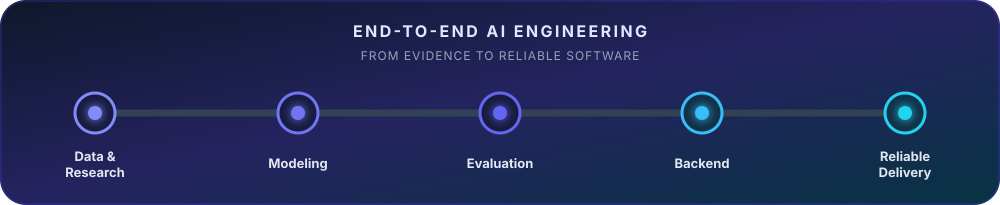
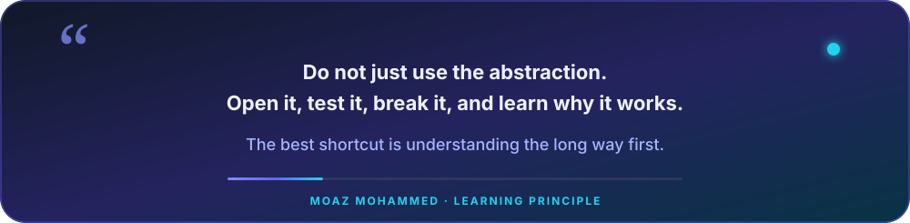

<div align="center">


[](https://git.io/typing-svg)

[](https://www.linkedin.com/in/moaz-mohammed-934a30307/)
[](mailto:moazmohammed198@gmail.com)
[](#)

</div>

## Building intelligence, understanding the system

I am an **AI Engineer and Computer Engineering student** focused on applied machine learning, retrieval systems, computer vision, and LLM-powered applications. I enjoy working below the abstraction layer too—building Go services, network protocols, command-line tools, and data-backed APIs to understand how reliable software works end to end.

I am currently open to **AI/ML engineering, applied LLM, computer vision, and backend engineering internships and junior roles**.

<div align="center">



</div>

### About me, in code

```python
class MoazMohammed:
    def __init__(self):
        self.role = "AI Engineer in training"
        self.location = "Ismailia, Egypt"
        self.current_quest = "Understand the magic before importing the library"
        self.inventory = {
            "Python": "for teaching machines",
            "Go": "for understanding what the machines are standing on",
            "C++": "for when milliseconds start asking questions",
        }
        self.favorite_problems = [
            "search results that almost understand the question",
            "models that perform brilliantly until the test set arrives",
            "papers with one diagram and seventeen missing details",
            "APIs that deserve a database and a proper README",
        ]

    def learn(self, topic):
        return topic.read().implement().break_it().measure().document()

    def status(self):
        return {
            "curiosity": "unlimited",
            "experiments_running": True,
            "open_to_opportunities": True,
        }
```

### Evidence over buzzwords

- Reproduced and improved a **CVPR 2016** group-activity-recognition architecture, reaching **88.86% accuracy** versus the paper's 81.9% baseline.
- Built a search and RAG engine from scratch across **TF-IDF, BM25, semantic retrieval, reciprocal-rank fusion, CLIP multimodal search, reranking, and cited generation**.
- Delivered **Modaresy**, a live tutor-discovery product, in six weeks; reached **60+ active users** and won **3rd place** at the Creativa Startup Competition.
- Implemented computer-vision, sequence-modeling, and agentic-AI projects with **PyTorch, TensorFlow, Hugging Face, LangChain, and LangGraph**.
- Expanded into systems engineering through Go projects covering **HTTP, TCP/UDP, PostgreSQL-backed APIs, JWT authentication, RSS aggregation, and CLI tooling**.

## Featured work

| Project | Engineering highlights | Result |
|---|---|---|
| **[Deep Activity Recognition](https://github.com/Eng-Moaz/Deep-Activity-Recognition)** | ResNet-50 person features, hierarchical team pooling, temporal LSTMs, reproducible training, real-time overlay demo | **88.86% accuracy** · +6.96 points over published B8 baseline |
| **[RAG Search Engine](https://github.com/Eng-Moaz/rag-search-engine)** | Hand-built inverted index, TF-IDF/BM25, sentence-transformer retrieval, RRF hybrid search, CLIP, cross-encoder reranking, Groq/Gemini RAG | Keyword → semantic → multimodal retrieval with evaluation |
| **[Modaresy](https://www.modaresy.me/)** | Tutor discovery, curated profiles, video samples, direct WhatsApp booking; product and UI/UX ownership | Live in 6 weeks · 60+ users · Creativa 3rd place |
| **[Chirpy](https://github.com/Eng-Moaz/chirpy)** | RESTful Go API with PostgreSQL, JWT + refresh-token auth, webhooks, profanity filtering, premium tier | Full backend authentication and data lifecycle |
| **[RSS Aggregator](https://github.com/Eng-Moaz/RSSAggregator)** | Multi-user Go CLI, PostgreSQL persistence, background feed ingestion, least-recently-fetched scheduling | Concurrent data ingestion and feed following |
| **[NYC Taxi Duration](https://github.com/Eng-Moaz/NYC-Taxi-Trip-Duration)** | End-to-end feature engineering and regression benchmark across linear models, forests, XGBoost, LightGBM, and CatBoost | Reproducible model comparison pipeline |

## More systems and experiments

- **Go and systems:** [Linko](https://github.com/Eng-Moaz/linko) · [Peril](https://github.com/Eng-Moaz/peril) · [Tubely](https://github.com/Eng-Moaz/tubely) · [HTTP From Scratch](https://github.com/Eng-Moaz/http-from-scratch) · [Forge CLI](https://github.com/Eng-Moaz/forge-cli) · [Pokédex](https://github.com/Eng-Moaz/pokedex)
- **LLM engineering:** [Production RAG Engine](https://github.com/Eng-Moaz/production-rag-engine) · [Applied LLM Engineering](https://github.com/Eng-Moaz/Applied-LLM-Engineering) · [LLM Mastery](https://github.com/Eng-Moaz/llm_mastery)
- **Applied ML:** [Fraud Detection](https://github.com/Eng-Moaz/Fraud-Detection-) · [Facial Emotion Recognition](https://github.com/Eng-Moaz/ieee-dl) · [Transient Plotter](https://github.com/Eng-Moaz/Transient-Plotter)
- **Creative AI:** [Roast My Taste](https://github.com/Eng-Moaz/roast-my-taste) — a tool-using conversational agent with search, memory, and a custom Streamlit interface.

## Engineering toolkit

### Languages and backend foundations

<div align="center">

[](https://skillicons.dev)

</div>

### Machine learning and intelligent systems

<div align="center">

[](https://skillicons.dev)

</div>

**Machine learning:** PyTorch · TensorFlow · Scikit-learn · Keras · XGBoost · LightGBM · CatBoost  
**LLM & retrieval:** Hugging Face · LangChain · LangGraph · RAG · BM25 · sentence-transformers · CLIP  
**Data:** Pandas · NumPy · PostgreSQL · Matplotlib · Seaborn  
**Software:** Python · Go · C++ · REST APIs · Git · Docker · Linux

## A principle worth sharing

<div align="center">



</div>

## GitHub activity

<div align="center">

[](https://git.io/streak-stats)


</div>

## Education and current growth

**B.Sc. in Computer Engineering**, Suez Canal University — expected 2028  
Coursework includes machine learning, deep learning, computer vision, algorithms, linear algebra, probability, and statistics.

Currently strengthening the bridge between **AI experimentation and production software** through deeper work in retrieval, evaluation, Go, databases, networking, and deployment.

### Current growth path

- Turn strong experiments into tested and deployed services.
- Deepen production habits around observability, security, migrations, and failure handling.
- Build fewer projects more completely—with benchmarks, demos, tests, and honest limitations.
- Combine AI depth with Go and backend fundamentals to own complete product features.

## Let’s connect

<div align="center">

Open to internships, junior opportunities, collaborations, and technically ambitious projects in **AI/ML, applied LLMs, computer vision, and backend systems**.

**[LinkedIn](https://www.linkedin.com/in/moaz-mohammed-934a30307/) · [Email](mailto:moazmohammed198@gmail.com) · [Repositories](https://github.com/Eng-Moaz?tab=repositories)**


</div>
